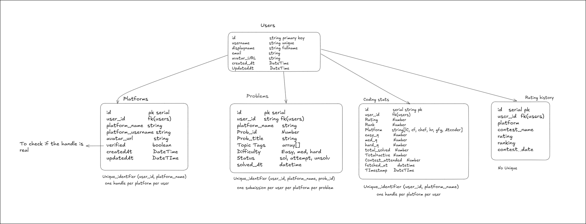
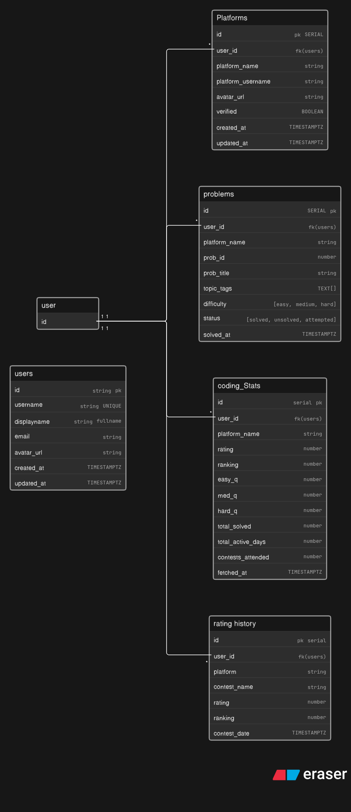

# Wobble

A personalized coding performance tracker designed for software engineers and coding interview aspirants. It helps users monitor and analyze their coding progress, track problem-solving performance, identify strengths and weaknesses, and stay consistent throughout their interview preparation journey. This tool serves as an effective companion for anyone preparing for technical coding rounds.

Features:
Users 
Multi-Platform
coding stats
Heat map
Rating Graph which includes all the platform rating
DSA visualizer
Problem list with Platform badge
Contest schedule
LinkedIn Shareable card (Entire & Platform by Platform)

# DB schema
